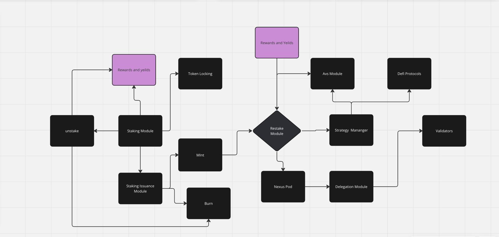

## NexusFi

Participants have the option to directly engage with the platform through a process known as native restaking. 

Unlike liquid staking, where tokens are staked through a liquid staking protocol, native restaking involves committing NIBI directly within a validator for additional commitments. This NIBI serves as a form of collateral, and if the validator deviates from its commitments, it risks losing the NIBI held within.

## Testnet Contract Address 
   *These contracts are deployed on Testnet-1 of Nibiru blockchain*
   
-**Staking Contract** = nibi1pvyd8sku8m8uafqytuefy52vkz7utj4empkycnv3chxc4npnhpns0w629r.

-**stNIBI token Contract** = nibi1jwc8jufz03vmtsrcwywptzksc4t9yjgnstax3r09rm9pcrl4jy9s4vpzel.

-**rstNIBI token Contract** = nibi17gxmfpc6l6s79dvghs5pxgruh3spxetx0td70qwq5jkd8sa5zx7sxvjwls.

-**reward dispatcher Contract** = nibi12y04ajv9fmh2n64mhtrltf8yzpqkl2a4djg8du24np5xklw5kvcq6dtsmj.

-**Validator Management Contract** = nibi1h3rnkjxargplk88nqg9y0xrwscj5phk8jkdhc7vcre72qp8gvfdsg8xa66 

## Table of Contents

1. [Introduction](#introduction)
2. [Architecture](#architecture)
3. [Smart Contracts](#smart-contracts)
4. [Quick Start](#quick-start)
5. [Glossary](#glossary)

## Introduction

Nexus Finance provides a robust platform for users to maximize their staking rewards through innovative restaking strategies. By locking tokens into the Nexus Finance system, users can earn compounded interest, interact with DeFi protocols, and manage their assets seamlessly.

## Architecture

The Nexus Finance architecture is composed of several interconnected modules that handle different aspects of the restaking ecosystem. Below is the architecture diagram, followed by a brief explanation of each component.

### Smart Contract Components 

1. **Staking**: 
   - Users stake NIBI tokens securely and efficiently.
   - Validates transactions and compliance with staking parameters.
   - Generates stNIBI tokens as proof of stake, simplifying staking rewards.

2. **Unstaking**:
   - Initiates seamless unbonding of NIBI tokens.
   - Processes undelegation to validators and calculates exchange rates.
   - Maintains platform stability and user asset integrity

3. **Withdraw Unbonded**:
   - Smooth withdrawal process for unbonded NIBI tokens.
   - Calculates withdrawable amounts based on unbonding periods
   - Ensures timely and accurate token withdrawals

4. **Rewards Dispatch**:
   - Automates rewards distribution process.
   - Withdraws and processes staking rewards efficiently
   - Separates fees and distributes rewards to stakeholders

5. **Slashing**:
   - Ensures resilience against slashing events.
   - Updates state with current exchange rates and slashing information
   - Protects staked assets and maintains platform integrity.

6. **Restake**:
   - Handles restaking through RecieveCW20 token messages.
   - Updates bond amounts securely with the bond function
   - Enhances platform integrity and manages staked token records.

7. **Withdraw stNIBI**:
   - Facilitates secure withdrawal of stNIBI tokens.
   - Constructs transaction messages for token transfer.
   - Efficiently manages liquidity withdrawals within the blockchain ecosystem

8. **Validator Management:**:
   - Manages validator list via add_validator and remove_validator functions.
   - Adds and removes validators securely for governance integrity.
   - Crucial for maintaining network stability and blockchain governance.

9. **Delegation Module**:
   - CW20 token contract for stNIBI tokens on Nibiru..
   - Configures token parameters and initial balances.
   - Secure deployment and functionality on the Nibiru chain.

