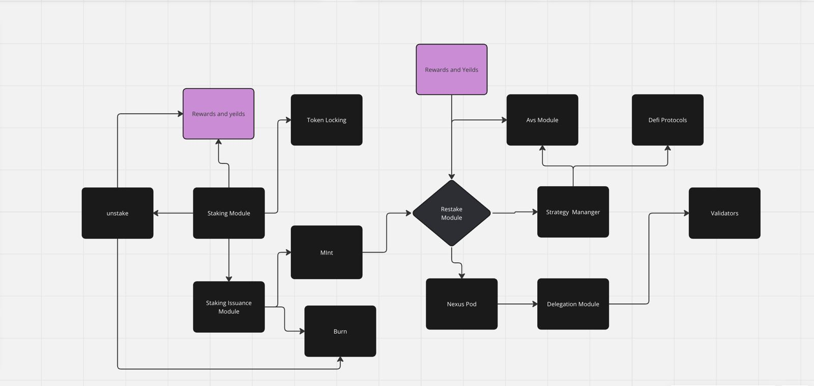

## NexusFi

NexusFi is a modular staking and restaking infrastructure built on the Nibiru blockchain.
It is designed to help users stake NIBI, mint liquid staking tokens, restake capital, and
manage validator and reward flows through secure on-chain contracts.

## What NexusFi delivers

- Native NIBI staking with liquid receipt tokens
- Restaking flows built for reusable capital
- Validator management and slashing awareness
- Reward distribution and withdrawal handling
- Testnet-ready contract deployment for real protocol operations

## Testnet Contract Addresses

*These contracts are deployed on Testnet-1 of the Nibiru blockchain.*

- **Staking Contract**: `nibi1pvyd8sku8m8uafqytuefy52vkz7utj4empkycnv3chxc4npnhpns0w629r`
- **stNIBI Token Contract**: `nibi1jwc8jufz03vmtsrcwywptzksc4t9yjgnstax3r09rm9pcrl4jy9s4vpzel`
- **rstNIBI Token Contract**: `nibi17gxmfpc6l6s79dvghs5pxgruh3spxetx0td70qwq5jkd8sa5zx7sxvjwls`
- **Reward Dispatcher Contract**: `nibi12y04ajv9fmh2n64mhtrltf8yzpqkl2a4djg8du24np5xklw5kvcq6dtsmj`
- **Validator Management Contract**: `nibi1h3rnkjxargplk88nqg9y0xrwscj5phk8jkdhc7vcre72qp8gvfdsg8xa66`

## Architecture

The architecture below shows the core protocol modules and how they coordinate staking,
restaking, rewards, and validator operations.

### Core Modules

1. **Staking**
   - Accepts NIBI deposits
   - Mints stNIBI as the liquid staking receipt
   - Keeps staking state aligned with protocol rules

2. **Unstaking**
   - Starts the unbonding flow for NIBI
   - Tracks exchange rates and undelegation status
   - Preserves user asset integrity during exit

3. **Withdraw Unbonded**
   - Releases unbonded NIBI after the waiting period
   - Calculates withdrawable balances
   - Completes the exit flow cleanly

4. **Rewards Dispatch**
   - Collects and distributes staking rewards
   - Handles fee separation and reward allocation
   - Keeps reward flows automated

5. **Slashing**
   - Records slashing-related state changes
   - Updates exchange rate data when needed
   - Protects protocol accounting during validator penalties

6. **Restake**
   - Accepts CW20 restake messages
   - Updates bonded amounts programmatically
   - Extends capital efficiency across the protocol

7. **Withdraw stNIBI**
   - Redeems stNIBI through token transfer flows
   - Supports liquidity-aware withdrawals
   - Keeps user exit mechanics simple

8. **Validator Management**
   - Adds and removes validators
   - Helps maintain protocol governance controls
   - Supports a healthy validator set

9. **Delegation Module**
   - Powers the stNIBI CW20 token
   - Defines token parameters and balances
   - Supports deployment and use on Nibiru
